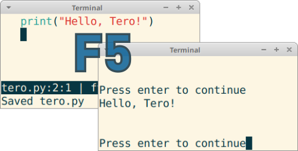

# micro-run

Save, run and compile your projects more efficiently without leaving the editor.

Micro run is a plugin for Micro editor.

---

## About

Below is the support table for the *Save & Run* feature

| Languages | Executable files |
| :------- | :--- |
| Go | Linux/UNIX |
| Go Test | |
| Python 3 | |
| Lua | |

> As an extra feature, micro-run can run any script that's marked as executable - in any language. 
> In Linux/UNIX, Executable files are those that have execute and read permissions that can be assigned using
> `chmod u+x foo` and usually have the shebang `#!/usr/bin/bar`  at the first line of the file.

## Use Case

When coding, it's convenient to run the current file and see the result immediately. Especially for Go (Golang) and other languages that don't have an interactive shell (REPL), it's nice to quickly test new features by writing a short program and hitting F5.

A feature for quickly running the code you are editing is common in integrated development environments (IDEs).

## Keybindings

- Press F5 to save and run the current file, F12 to make, F9 to make in background
- F12 compiles your project even if Makefile is in a higher directory. It goes up (cd ..) until it finds make file or is at root directory
- F9 runs 'make' in background, allowing you to keep editing while your project compiles

## Limitations

Tested only on Linux, might also work on other systems.

As you are literally running the current file, no effort has been taken to prevent file name based injections. Does not work with file names with spaces or other special characters.

## See also

[micro-jump](https://github.com/terokarvinen/micro-jump) - Jump to any function, class or heading with F4. Go, Markdown, Python, C... (+40 others). A plugin for micro editor.
